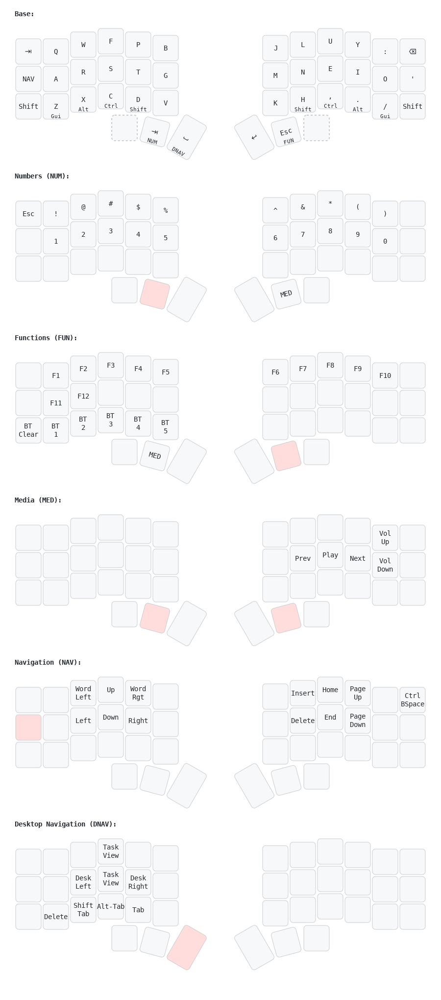

# ZMK Config Corne

## Highlights

- Colemak-DH alpha base
- Bottom-Row mods, aka Home-row mods on the bottomw row
  - Use of both tap-preferred and hold-prefererd Layer-tap options
- TKL layer under home row, for instant access to arrow keys and Home-block
- Heavy use of combos:
  - Utility combos on left hand
  - Symbol character combos on right hand
  - Include 3 and 4-key linear combos, and non-adjacent 2-key combos
- Focus on providing useful functionality with left-hand only while right hand is using the mouse
  - Copy/paste, delete, backspace combos
  - Desktop navigation layer
  - Arrow cluster layer
- Desktop navigation layer for management of Windows virtual desktops
- Reduce reliance on outer rows and inner thumb keys for eventual move to 34-key layout

## Keymap

> Drawn with [Keymap Drawer](/caksoylar/keymap-drawer)

## Combos

Combos have been very easy to implement and get used to. I quickly added many combos to replace my symbols layer, while also adding extra functionality. The combos are organized by hand; the right hand combos include all the symbols and characters used while typing, whereas the left hand combos cover functionality that can be helpful while my right hand is using the mouse.

**A few thoughts**:

* As of the current ZMK version, combos may conflict with tap/hold modifiers when activating several modifiers simultaneously. This keymap mostly avoids this issue with bottom-row-mods, so home-row combos are not affected. A few combos are present on the left-hand, so left-hand mods must be pressed sequentially to avoid triggering the combos.
* I found that combos that use only pinky/ring-finger are harder to activate. I only have a few of those, but prefer to keep all combos on the 3 stronger fingers.

> Drawn with [Keymap Drawer](/caksoylar/keymap-drawer)

### Right Hand Combos

**Simple shapes**

These are simple horizontal combos, easy to roll while typing. 

All keys can access their ANSI shifted version with Shift, the only exception being Tildae/Backquote.

* M-N: Underscore
* N-E: Dash
* E-I: Single Quote
* I-O: Double Quote
* N-E-I: Equal
* N-I: Colon
* J-L: Back Quote
* L-U: Tildae 
  * Mod-morph to output backquote on Shift
* U-Y: Semi-colon
* L-U-Y: Plus

**Other Shapes**

Those combos includes keys on two rows. Their shapes make them easy to remember:

* N-U: Forward slash
* U-I: Backslash
* H-E: Left Square Bracket / Curly Bracket
* E-'.': Right Square Bracket / Curly Bracket
* J-M: Pipe

### Left Hand Combos

* Q-W: Close (Ctrl-W)
* W-F: Escape
* F-P: Tab
* A-R: Select All (Ctrl-A)
* R-S: Backspace
* R-S-T: Delete Word (Ctrl-Backslash)
* A-R-S-T: Delete line (macro)
* S-T: Delete
* T-G: New line below (macro)
  * Mod-morphed to output New line above (macro), vim-style
* Z-X: Undo (Ctrl + Z)
* X-C: Copy (Ctrl + C)
* X-C-D: Cut (Ctrl + X)
* C-D: Paste (Ctrl + V)
* D-V: Select current line (macro)